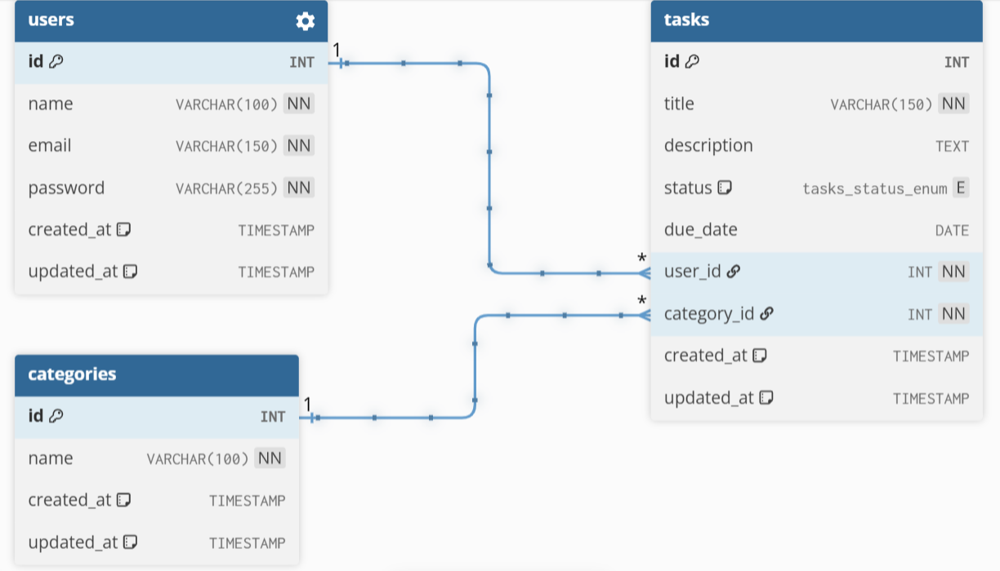
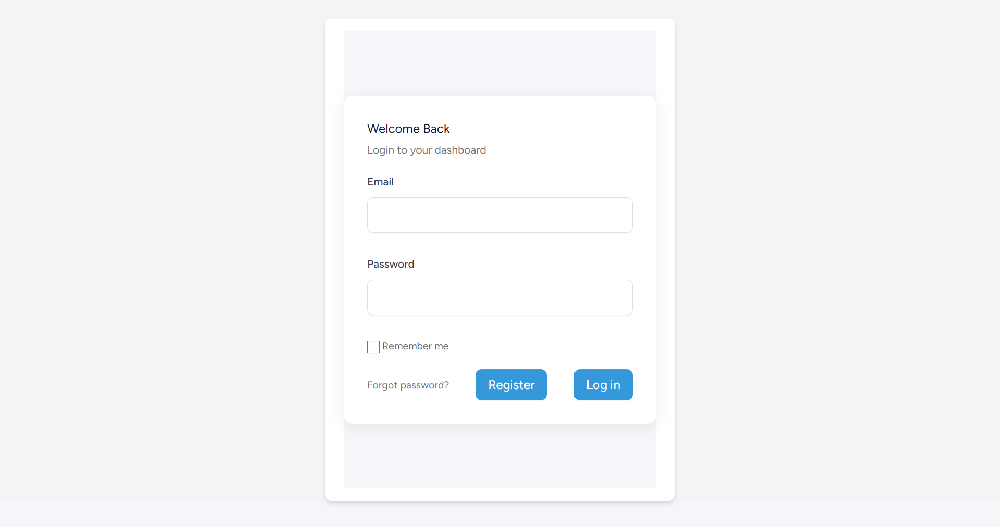
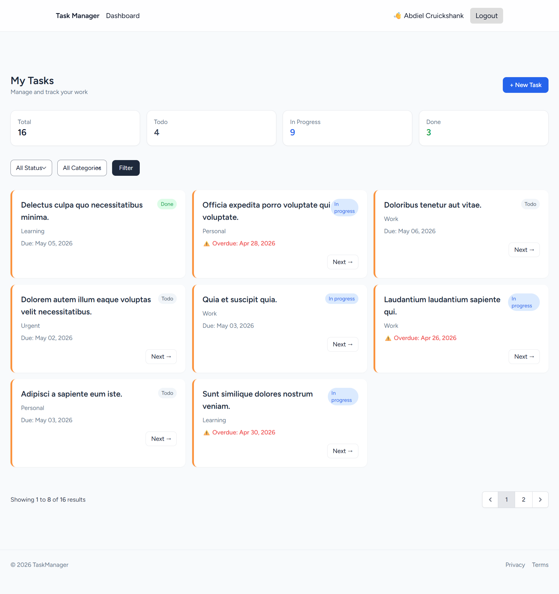
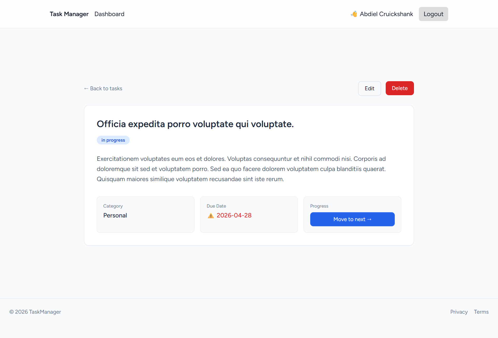
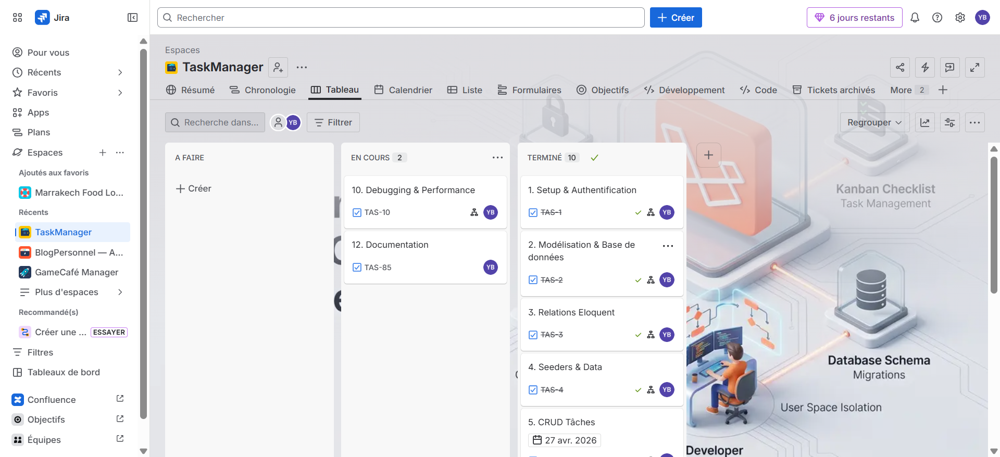

# Task Management App (MVP)

## Overview

Task Management App is a web-based internal tool built with **Laravel**.

It allows employees to manage their daily tasks in a simple and secure way. Each user has a private workspace where they can create, update, and track their own tasks.

The application follows Laravel best practices using:
- MVC Architecture
- Eloquent ORM
- Blade templating
- Named routes
- Middleware authentication
- Policy-based authorization

---

## 🚀 Features

## 🔐 Authentication

Users can:
- Register (name, email, password)
- Login securely
- Logout securely

---

## 📋 Task Management

Authenticated users can:
- View all their tasks
- Create a new task
- Edit a task
- Delete a task (with confirmation)
- Quickly change task status from the list

### Task Fields:
- Title
- Description
- Category
- Status:
  - To Do
  - In Progress
  - Done
- Created at
- Due date (bonus)

---

## 🔎 Filtering

Users can:
- Filter tasks by status
- Filter tasks by category

---

## 🎁 Bonus Features

- Task counter per status (dashboard)
- Overdue tasks highlighted (due_date)
- Pagination (8 tasks per page)
- Policy-based authorization

---

## 🛠 Installation

### Prerequisites

- PHP 8.2+
- Composer
- Node.js + NPM
- MySQL
- Laravel CLI (optional)
- XAMPP / Laragon / WAMP

---

## Steps

### 1. Clone project

```bash
git clone https://github.com/BEN-ESSAHRAOUI-Yassine/TaskManagerLaravel.git
cd TaskManagerLaravel
```

### 2. Install dependencies

```bash
composer install
npm install
```

### 3. Environment file

```bash
cp .env.example .env
php artisan key:generate
```

### 4. Configure database

Edit `.env`

```env
DB_CONNECTION=mysql
DB_HOST=127.0.0.1
DB_PORT=3306
DB_DATABASE=taskmanagerlaravel
DB_USERNAME=root
DB_PASSWORD=
```

### 5. Run migrations + seeders

```bash
php artisan migrate:fresh --seed
```

### 6. Compile assets

```bash
npm run build
```

### 7. Start server

```bash
php artisan serve
```

Visit:

```text
http://127.0.0.1:8000
```

---

## Technologies Used

* Laravel 13
* PHP 8+
* MySQL
* Blade
* Eloquent ORM
* Laravel Breeze
* Tailwind CSS
* Vite
* MVC Architecture

---

## Directory Structure

```text
app/
 ├── Http/Controllers
 │   ├── TaskController.php
 │   └── DashboardController.php
 │
 ├── Models
 │   ├── User.php
 │   ├── Task.php
 │   └── Category.php
 │
 ├── Policies
 │   └── TaskPolicy.php

database/
 ├── migrations/
 └── seeders/

resources/views/
 ├── layouts/
 ├── tasks/
 ├── dashboard/
 └── auth/

routes/
 └── web.php
```

---

## Security Measures

* Laravel Authentication
* Password hashing
* CSRF protection
* Validation with `$request->validate()`
* Auth middleware on all routes
* Policy-based authorization (strict ownership control)

---

## Routing System

| Method | Route                | Controller                  |
| ------ | -------------------- | --------------------------- |
| GET    | /dashboard           | DashboardController@index   |
| GET    | /tasks               | TaskController@index        |
| GET    | /tasks/create        | TaskController@create       |
| POST   | /tasks               | TaskController@store        |
| GET    | /tasks/{task}/edit   | TaskController@edit         |
| PUT    | /tasks/{task}        | TaskController@update       |
| DELETE | /tasks/{task}        | TaskController@destroy      |
| PATCH  | /tasks/{task}/status | TaskController@updateStatus |


---

## Database Design

### DB Diagram




### Tables

* users
* categories
* tasks

### Relationships

* One user has many articles
* One category has many articles
* One article belongs to one user
* One article belongs to one category

---

## Notes

* Visitors only see published articles
* Draft articles stay private
* Unauthenticated users are redirected to login

---

## Screenshots

### Login page



### Dashboard (User Panel)



### task page



### [Jira](https://ybenessahraoui.atlassian.net/jira/software/projects/TAS/boards/101?atlOrigin=eyJpIjoiZjgyOWJhNWM1NmE0NDc2YmEyMzFkYjhhMDVmOTdiMmQiLCJwIjoiaiJ9) Board




